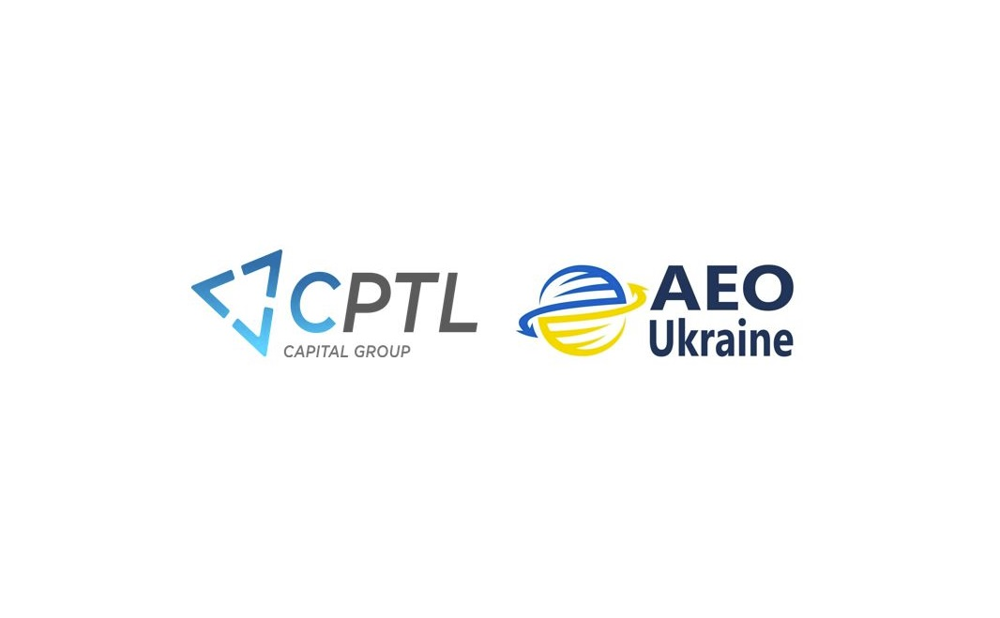





<!-- excerpt start -->
Компанія CPTL вкотре підтвердила відповідність своїх процесів високим стандартам та отримала довіру з боку митних органів. Раді Вам повідомити, що наше підприємство отримало статус Авторизованого Економічного Оператора (АЕО-С). 
<!-- excerpt end --> 
АЕО - це компанія-учасниця, міжнародного ланцюга постачань, відповідає встановленим митними органами критеріям та має право використовувати спеціальні переваги, саме:

✅ пріоритетний режим оформлення вантажів наших клієнтів на митниці за рахунок виконання митних формальностей в першочерговому порядку, 

✅ зменшення кількості перевірок документів та доглядів вантажів, що сприяє швидкому митному оформленню, 

✅ покращення репутації та взаємовідносин з митними органами, 

✅ ефективність операційних бізнес процесів та високий стандарт якості обслуговування наших клієнтів. 

✅ підвищення довіри зі сторони наших клієнтів адже з їхніми товарами працює партнер, визнаний за свою надійність та ефективність. 

Наша команда активно була залучена в популяризацію інституту АЕО в Україні, адже наші фахівці вже допомогли підготуватися деяким Клієнтам до отримання авторизацій. 

Ми продовжуємо працювати над наданням сервісу найвищої якості, підтверджуючі свою репутацію на ринку як прозора системна компанія, вирішуючи  завдання та виклики з якими зіштовхуються наші клієнти будь-якої складності.