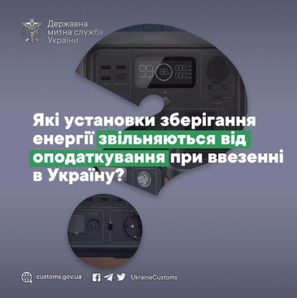





<!-- excerpt start -->
У зв’язку з набранням чинності Законами України від 16.07.2024 №3853-ІХ та №3854-ІХ окремі категорії товарів звільняються від сплати мита та ПДВ при ввезенні в Україну.  
<!-- excerpt end --> 
При цьому законодавством передбачені чіткі вимоги до цих товарів.
Так, відповідно до цих Законів, товари, які класифікуються за кодом 8507 60 00 00 УКТЗЕД, звільняються від оподаткування ввізним митом та ПДВ (крім установок зберігання енергії потужністю менш як 300 Вт змінного та/або постійного струму та окремих літій-іонних комірок ємністю менш як 200 А/год).

Таким чином, 
НЕ підпадають під пільгове ввезення відповідно до законодавства:
1. Портативні зарядні пристрої потужністю менш як 300 Вт.
Тобто, зарядні пристрої потужністю, наприклад, 128 Вт, 200 Вт і тому подібні будуть оподатковуватись за загальними правилами.
2. Повербанки потужністю меншее 300 Вт.
Відповідно, якщо пристрій розрахований більше, ніж на 300 Вт, він підпадає під дію Законів і митні платежі не підлягають сплаті.
3. Літій-іонні комірки, які мають ємність менш як 200 А/год.
Натомість акумулятори, які складаються з однієї або більше послідовно з’єднаних електрохімічних комірок, які часто називаються «акумуляторними батареями», ємністю більше 200 А/год, підпадають під дію Законів і не підлягають оподаткуванню.
[Сайт Держмитслужби](https://customs.gov.ua/).